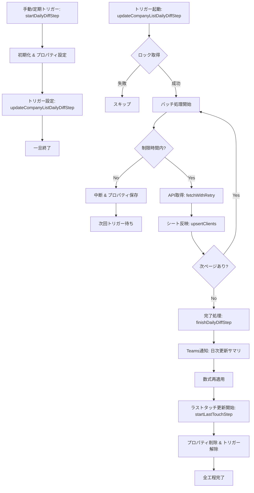

# 日次企業情報更新処理仕様書

## 概要
日次の企業情報更新プロセス（`startDailyDiffStep`）は、HotProfile APIから前日以降の更新データを取得し、Google Sheets「企業情報」シートに反映する処理です。
大量データの更新時にもタイムアウト（6分制限）しないよう、**バッチ分割＋トリガー自動継続** の仕組みを採用しています。

## 処理フロー

## 詳細仕様

### 1. 開始処理 (`startDailyDiffStep`)
- **役割**: 処理の初期化と最初のトリガー設定。
- **引数**: `intervalMinutes`（トリガー間隔、デフォルト5分）。
- **動作**:
    1. 前回実行日時（`LAST_DIFF_RUN`）から現在までの期間を特定。
    2. 処理状態管理用のスクリプトプロパティ（`DAILY_DIFF_*`）を初期化。
    3. 実行関数 `updateCompanyListDailyDiffStep` のトリガーを設定。

### 2. バッチ更新処理 (`updateCompanyListDailyDiffStep`)
- **役割**: データの分割取得とシートへの反映。
- **データ取得範囲**:
    - 前回正常完了日時（`LAST_DIFF_RUN`）から現在日時までの間に更新があった**全企業**を取得します。
    - APIのページネーション（1ページ200件）を利用し、検索条件にヒットする全てのデータを再帰的に取得します。
- **動作**:
    - **時間監視**: 実行開始から4分40秒を経過すると、処理を中断して次回トリガーに委ねます（未取得ページがある場合は次回そのページから再開）。
    - **APIリトライ**: 通信エラー時は `fetchWithRetry` により最大3回まで自動リトライします。
    - **進捗保存**: 処理したページ番号や追加・更新件数をプロパティに保存し、継続実行時に引き継ぎます。

### 3. 完了処理 (`finishDailyDiffStep`)
- **役割**: 更新完了後の後処理。
- **動作**:
    1. **通知**: Teamsに処理結果サマリ（追加数、更新数、所要時間）を通知。
    2. **数式適用**: `reapplyFormulasFromSettings` を呼び出し、計算式列をメンテナンス。
    3. **ラストタッチ更新**: `startLastTouchStep` を呼び出し（`isDiffMode=true`）、API差分ベースの高速更新プロセスを開始します。
    4. **クリーンアップ**: 一時プロパティの削除とトリガーの削除。
    5. **次回基準日更新**: 成功時のみ `LAST_DIFF_RUN` を更新。

### 4. ラストタッチ更新処理 (`updateLastTouchDailyDiffStep`)
- **役割**: 前回実行以降に更新された日報を一括取得し、シートに反映します（日次差分モード）。
- **特徴**:
    - 全件ループを行わず、API (`daily_reports`) の `search[from_updated_on]` で対象を絞り込むため、APIコール数を大幅に削減します。
    - APIの `client_id` とシートの「新会社ID」を照合し、`visit_on` が新しい場合のみ更新します。
    - **ページネーション**: 更新数が多い場合も自動ループして全件取得します。

## スククリプトプロパティ一覧

| プロパティ名 | 用途 |
|--------------|------|
| `LAST_DIFF_RUN` | 前回の正常完了日時（次回の取得開始点） |
| `DAILY_DIFF_FROM` | 今回の取得開始日時（一時） |
| `DAILY_DIFF_TO` | 今回の取得終了日時（一時） |
| `DAILY_DIFF_PAGE` | 現在処理中のAPIページ番号 |
| `DAILY_DIFF_STATS_*` | 追加・更新・NOT_FOUNDの累積件数 |

## エラーハンドリング
- **APIエラー**: 指数バックオフ（1s, 2s, 4s）付きで3回リトライ。それでも失敗した場合はエラー終了し、Teamsにエラースタックを通知。
- **プロセス中断**: 時間制限による中断は正常動作として扱われ、エラー通知は飛びません。
- **ロック競合**: 他のプロセスが実行中の場合はスキップされます。
