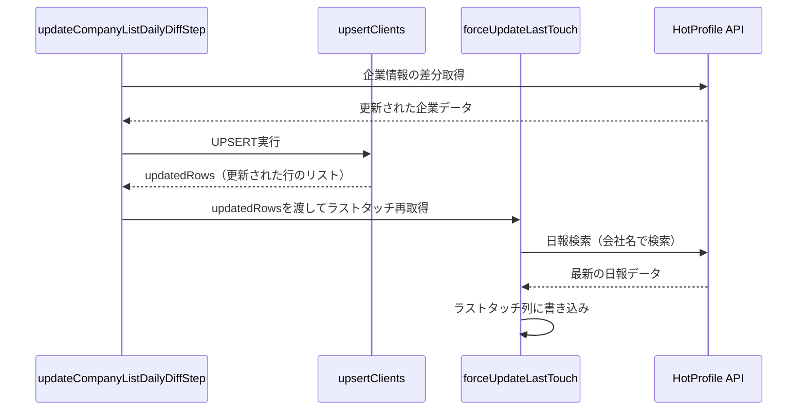

# ウォークスルー: 企業情報更新時のラストタッチ再取得

## 変更概要
日次の企業情報更新で企業情報が更新された際、ラストタッチの値が消えてしまう問題を修正しました。更新があったレコードに対して、即座にラストタッチを再取得するようにしました。

## 変更ファイル

### [ラストタッチ確認.js](file:///c:/Users/ten01/OneDrive/%E3%83%89%E3%82%AD%E3%83%A5%E3%83%A1%E3%83%B3%E3%83%88/VS-Code/VS-Code/%E3%83%9B%E3%83%83%E3%83%88%E3%83%97%E3%83%AD%E3%83%95%E3%82%A1%E3%82%A4%E3%83%AB%E3%81%8B%E3%82%89%E3%83%87%E3%83%BC%E3%82%BF%E5%8F%96%E5%BE%97/%E3%83%A9%E3%82%B9%E3%83%88%E3%82%BF%E3%83%83%E3%83%81%E7%A2%BA%E8%AA%8D.js)
- `forceUpdateLastTouch(targets)` 関数を新規追加
- 並列APIコール (`UrlFetchApp.fetchAll`) で効率的に処理
- `getAllClientIdsFromReport` を再利用して新旧会社IDのマッチングを実施

render_diffs(file:///c:/Users/ten01/OneDrive/%E3%83%89%E3%82%AD%E3%83%A5%E3%83%A1%E3%83%B3%E3%83%88/VS-Code/VS-Code/%E3%83%9B%E3%83%83%E3%83%88%E3%83%97%E3%83%AD%E3%83%95%E3%82%A1%E3%82%A4%E3%83%AB%E3%81%8B%E3%82%89%E3%83%87%E3%83%BC%E3%82%BF%E5%8F%96%E5%BE%97/%E3%83%A9%E3%82%B9%E3%83%88%E3%82%BF%E3%83%83%E3%83%81%E7%A2%BA%E8%AA%8D.js)

### [企業情報.js](file:///c:/Users/ten01/OneDrive/%E3%83%89%E3%82%AD%E3%83%A5%E3%83%A1%E3%83%B3%E3%83%88/VS-Code/VS-Code/%E3%83%9B%E3%83%83%E3%83%88%E3%83%97%E3%83%AD%E3%83%95%E3%82%A1%E3%82%A4%E3%83%AB%E3%81%8B%E3%82%89%E3%83%87%E3%83%BC%E3%82%BF%E5%8F%96%E5%BE%97/%E4%BC%81%E6%A5%AD%E6%83%85%E5%A0%B1.js)
- `upsertClients`: 更新された行の情報 (`updatedRows`) を追跡し、戻り値として返すように変更
- `updateCompanyListDailyDiffStep`: `upsertClients` の戻り値を受け取り、`forceUpdateLastTouch` を呼び出すように変更

render_diffs(file:///c:/Users/ten01/OneDrive/%E3%83%89%E3%82%AD%E3%83%A5%E3%83%A1%E3%83%B3%E3%83%88/VS-Code/VS-Code/%E3%83%9B%E3%83%83%E3%83%88%E3%83%97%E3%83%AD%E3%83%95%E3%82%A1%E3%82%A4%E3%83%AB%E3%81%8B%E3%82%89%E3%83%87%E3%83%BC%E3%82%BF%E5%8F%96%E5%BE%97/%E4%BC%81%E6%A5%AD%E6%83%85%E5%A0%B1.js)

## 処理フロー

## 検証方法
1. GASエディタにコードをデプロイ
2. テスト用に既知の企業の「更新日時」を古い値に変更
3. `startDailyDiffStep()` を実行
4. 更新された企業のラストタッチ列に値が入っていることを確認
5. ログで `forceUpdateLastTouch` のメッセージを確認
