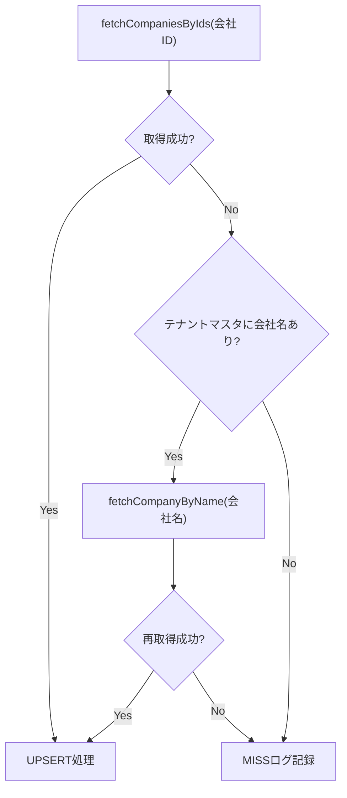

# 週次リセット時の会社ID変更への対応 - Walkthrough

## 変更概要

`企業情報.js` に対して、週次リセットで会社IDが変更された場合に会社名で再取得するフォールバック処理を追加しました。

## 変更内容

### 1. `getTenantMasterData` の修正

- ヘッダエイリアスに `companyName: ["ご契約者_法人名", "法人名", "会社名"]` を追加
- テナントマスタシートから会社名を読み取り、戻り値に `companyName` を含めるように修正

### 2. `fetchCompanyByName` の新規追加

- HotProfile API (`clients/get_entry_list`) に対して `search: { name: companyName }` で会社名検索を行う関数を追加
- 完全一致の結果を優先し、なければ先頭の結果を返す

### 3. `updateCompanyListStepSingleIdMode` の修正

- `fetchCompaniesByIds` で `null` が返された場合、テナントマスタの `companyName` を使って `fetchCompanyByName` で再取得を試みる
- 再取得成功時はそのまま UPSERT 処理に進む
- 再取得失敗時は MISS ログに会社名を含めて記録

## 処理フロー

## 検証

- コード上のロジック整合性を確認済み
- 実環境での動作確認はデプロイ後に実施してください
